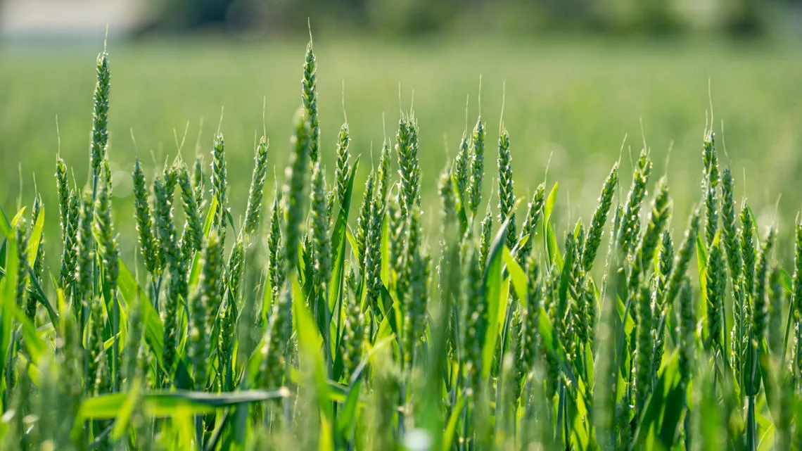
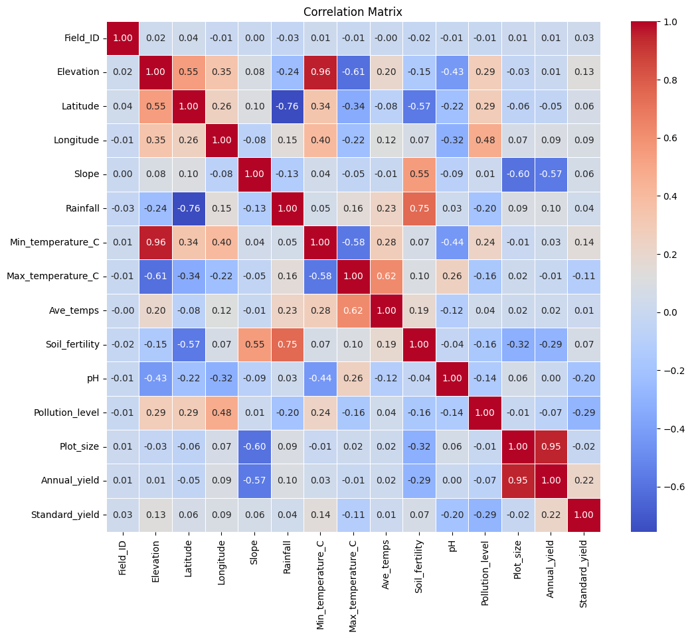
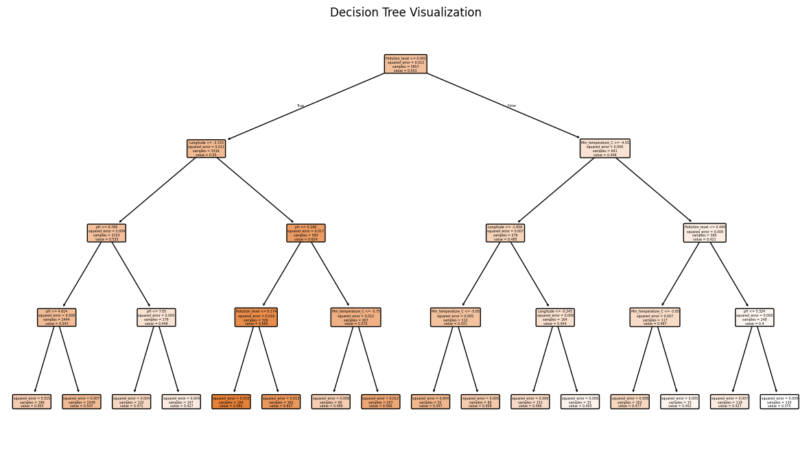
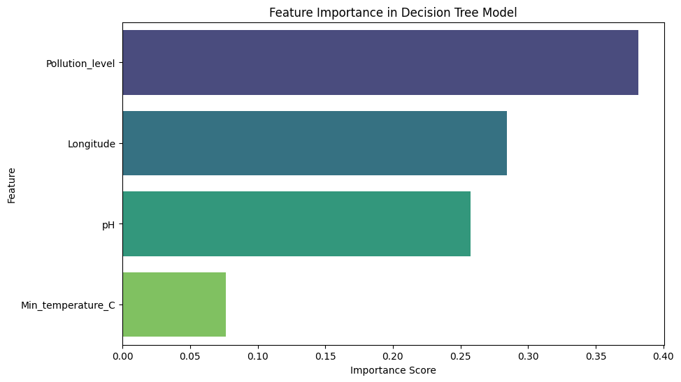

# **PREDICTION OF FARM YIELD IN MAJI NDOGO**  
*Decision Tree Regression | Farm Yield Modeling*  



## **INTRODUCTION**  
Agricultural productivity in **Maji Ndogo** is influenced by **geographic, climatic, and soil conditions**. This project leverages **Decision Tree Regression** to predict **standardized farm yield** based on multiple environmental factors.  

By understanding key **yield predictors**, this model aids in **data-driven farming decisions** for optimized agricultural output.  

---

## **PROBLEM STATEMENT**  
Farmers in Maji Ndogo face uncertainty regarding **which environmental factors most affect yield**.  
This project aims to:  
- **Analyze farming data** to uncover yield patterns.  
- **Identify key environmental predictors** of farm yield.  
- **Develop a Decision Tree Regression Model** for yield prediction.  
- **Visualize the Decision Tree** to improve model interpretability.  

---

## **SKILL DEMONSTRATION**  
- **Data Cleaning & Preprocessing**: Handling missing values, encoding categorical data.  
- **Exploratory Data Analysis (EDA)**: Understanding the relationships between environmental factors and yield.  
- **Feature Engineering**: Selecting relevant variables for prediction.  
- **Decision Tree Regression**: Training and optimizing a **tree-based model**.  
- **Model Visualization**: Plotting the decision tree structure and feature importance.  

---

## **DATA SOURCING**  
The dataset consists of **agricultural records** from Maji Ndogo, containing:  

### **1. Geographic Features**  
- **Elevation, Latitude, Longitude** – Geospatial data.  
- **Slope** – Measures land inclination.  

### **2. Weather Features**  
- **Rainfall (mm)**  
- **Minimum & Maximum Temperature (°C)**  
- **Average Temperature (°C)**  

### **3. Soil & Crop Features**  
- **Soil Fertility Index (0-1)**  
- **Soil Type & pH Level**  
- **Chosen Crop**  

### **4. Farm Management Features**  
- **Pollution Level (0-1)**  
- **Plot Size (Hectares)**  
- **Annual Yield (kg per hectare)**  

### **5. Target Variable**  
- **Standardized Yield** – Normalized yield independent of field size or crop type.  

---

## **EXPLORATORY DATA ANALYSIS (EDA)**  
EDA was performed to understand **farming conditions and yield patterns**.  

### **1. Data Overview**  
- **Checked dataset structure** using `.info()` and `.describe()`.  
- **Identified missing values** and handled inconsistencies.  

### **2. Feature Distributions**  
- **Histograms & Box Plots** for soil fertility, rainfall, temperature, and pollution levels.  
- **Scatter Plots** to visualize the relationship between yield and environmental factors.  

### **3. Correlation Analysis**  
- **Heatmap** showing relationships between rainfall, temperature, soil type, and crop yield.  
- **Pairplot** to analyze interactions between multiple variables.  

  

### **4. Key Insights**  
- **Rainfall and soil fertility** are major drivers of farm yield.  
- **Pollution negatively impacts crop yield**.  
- **Certain soil types are better suited for high-yield crops**.  

---

## **MODELLING**  
A **Decision Tree Regression Model** was built to predict **standardized farm yield**.  



### **1. Model Implementation**  
- **Independent Variables (`X`)**: Selected environmental and management features.  
- **Dependent Variable (`y`)**: Standardized yield.  
- **Model Used**: `sklearn.tree.DecisionTreeRegressor`  

### **2. Model Optimization**  
- **Hyperparameter tuning** (`max_depth`, `min_samples_split`).  
- **Cross-validation** to prevent overfitting.  

### **3. Model Evaluation**  
- **Mean Absolute Error (MAE)** – Measures prediction accuracy.  
- **Mean Squared Error (MSE)** – Penalizes large errors.  
- **R² Score** – Explains variance in farm yield due to environmental factors.  

---

## **DECISION TREE VISUALIZATION**  
Understanding how the **Decision Tree model** makes predictions.  

### **1. Tree Structure**  
A graphical representation of the **decision-making process**:  
```python
from sklearn.tree import plot_tree
import matplotlib.pyplot as plt

plt.figure(figsize=(15, 8))
plot_tree(model, feature_names=X_train.columns, filled=True, rounded=True)
plt.title('Decision Tree Visualization')
plt.show()
```
- **Interpretation:** Displays **how features influence predictions** at each split.  

### **2. Feature Importance**  
Identifying the most **impactful factors on farm yield**:  
```python
import seaborn as sns
import pandas as pd

feature_importance = pd.DataFrame({'Feature': X_train.columns, 'Importance': model.feature_importances_})
feature_importance = feature_importance.sort_values(by='Importance', ascending=False)

plt.figure(figsize=(10,6))
sns.barplot(x='Importance', y='Feature', data=feature_importance, palette='viridis')
plt.title('Feature Importance in Decision Tree Model')
plt.show()
```



- **Insight:** Determines **which factors drive yield predictions** the most.  

---

## **CONCLUSION**  
1. **Soil fertility and rainfall** are the strongest predictors of farm yield.  
2. **Pollution negatively affects yield**, reducing productivity.  
3. **Decision Tree Regression successfully models farm yield trends**.  
4. Future improvements should include **ensemble methods (Random Forest, XGBoost)** for better accuracy.  


